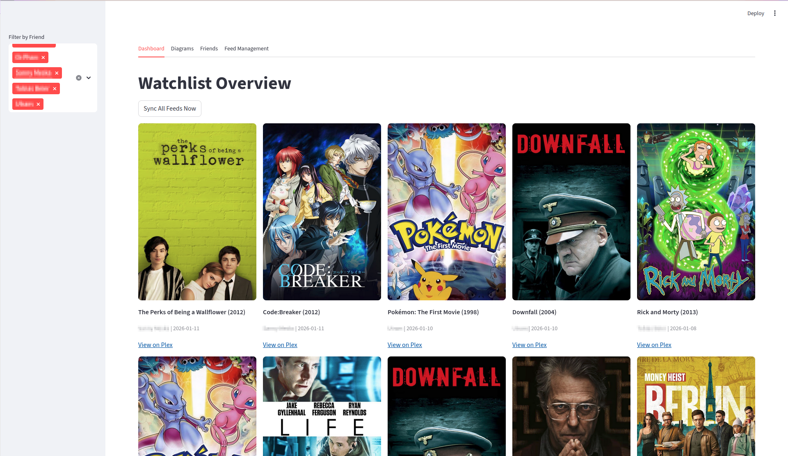

# plex-watchlist-analyser

A small Streamlit app to collect and visualise Plex watchlist RSS feed entries for friends.

## What it does

- Reads one or more Plex Watchlist RSS feeds and stores entries in a local SQLite database (`plex_vault.db`).
- Provides a Streamlit UI to view collected items, manage known friends (map Plex IDs to friendly names), and manage RSS feed configuration.
- Adds a "Diagrams" tab with two visualisations:
	- Requests per User: bar chart showing how many items each friend has added to their watchlist.
	- Requests over Time: time-series showing number of requests aggregated by day, week, or month.

## Requirements

This project uses Python 3.8+ and the libraries listed in `requirements.txt`.

Minimum dependencies (already in `requirements.txt`):

- streamlit
- feedparser
- pandas

Install them with (and create an environment):

```bash
python3 -m venv .venv
source .venv/bin/activate
pip install -r requirements.txt
```

## Running

Start the Streamlit app:

```bash
streamlit run plex-manager.py
```

The app will open in your browser (usually at http://localhost:8501). Use the UI tabs to:

- Dashboard — view recent watchlist items and sync all configured feeds.
- Diagrams — view the new visualisations (requests per user, requests over time).
- Friends — map Plex author IDs to friendly names.
- Feed Management — add/remove the RSS feed URLs used to populate the database.



## Scheduling automatic sync (cron)

You can run periodic automatic syncs of your RSS feeds using a system cron job (or a systemd timer). A small helper script is provided at `scripts/sync_feeds.py` which calls the same update logic the Streamlit UI uses.

1. Make the script executable and test it once from the project root:

```bash
chmod +x scripts/sync_feeds.py
```

2. Add a cron entry to run every 4 hours. Edit your crontab with `crontab -e` and add a line like this (replace `/path/to/plex-watchlist-analyser` with your repo path):

```cron
# run every 4 hours at minute 5 (safer to avoid exact hour boundary)
5 */4 * * * cd /path/to/plex-watchlist-analyser && source .venv/bin/activate && python3 scripts/sync_feeds.py >> sync_feeds.log 2>&1
```

Notes:
- The script will create `plex_vault.db` if it doesn't exist and will populate the tables.
- Output is appended to `sync_feeds.log` in the repo directory — change that path if you'd prefer a central log location.

## Contributing

Feel free to open issues or PRs. If you change the schema, update the `init_db()` function in `plex_core.py` to migrate/create tables accordingly.
